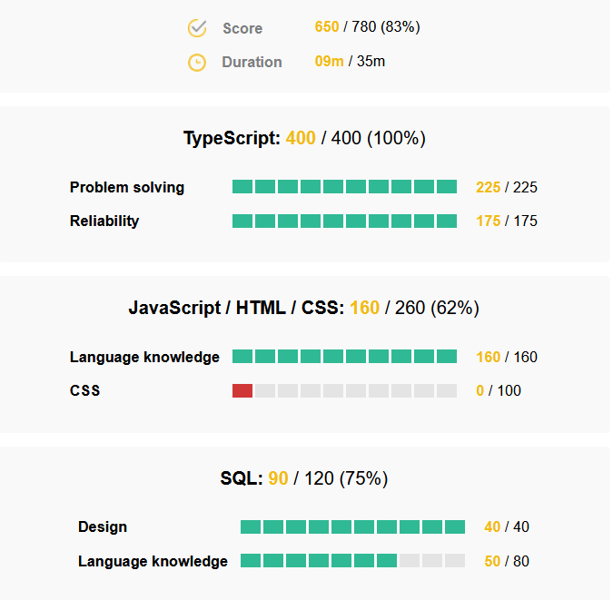

# Codingame Solver

This extension can be used to pass Codingame exercise automatically.

Then go to `chrome://extensions` and [load the unpacked extension](https://developer.chrome.com/docs/extensions/mv3/getstarted/development-basics/)

https://github.com/Aschen/codingame-solver/assets/4447392/2e4b105d-7605-4791-8785-dd4b09e4a9ca

## Why?

From my point of view, asking to solve coding challenges that have no relation to the real problems encountered in the professional environment has never been an effective method of evaluating a candidate.

This is even less the case since the arrival of LLMs like GPT-4, if these tools are capable of solving these problems for us then shouldn't we focus on higher level problems and let them do their thing?

It's as if a lax firm made a multiple choice test on knowledge of the penal code to evaluate for the position as a prosecutor for a trial. Not very relevant.

## How it works

This is a Chrome extension with the usual 3 parts communicating with each other:

- extension popup active when clicked
- service worker running in the background
- content script injected on the webpage

### Coding challenge solving

- Click on the extension to open the popup
- Click the "Solve coding exercise" button from the extension popup
- Select the div containing the instructions
- enjoy

The extensions use the Chrome DevTools protocol to simulate user input in the text editor.

When the button is clicked:

- call the worker
- start debugger
- call the content script to start an element picker to select the instructions (Codingame randomize css class and IDs)
- use GPT-4 to stream code answer
- input key by key the answer (harder than you think, look at [typeText](https://github.com/Aschen/codingame-solver/blob/master/service-worker.js#L95))

### QCM solving

Roughly the same kind of workflow with the element picker but then the answer is simply displayed in the console.

### Generic question

Take the entire text body and try to find an answer to any question inside, then write the result in the console.

## Naming

"Jaime la nature" was the name of the Chrome extension to cheat at the informatic cultur exam at Epitech. This exam was a huge QCM so either you had edeitic memory or like 80% of the student you have cheat to succeed (but don't get caught!).
